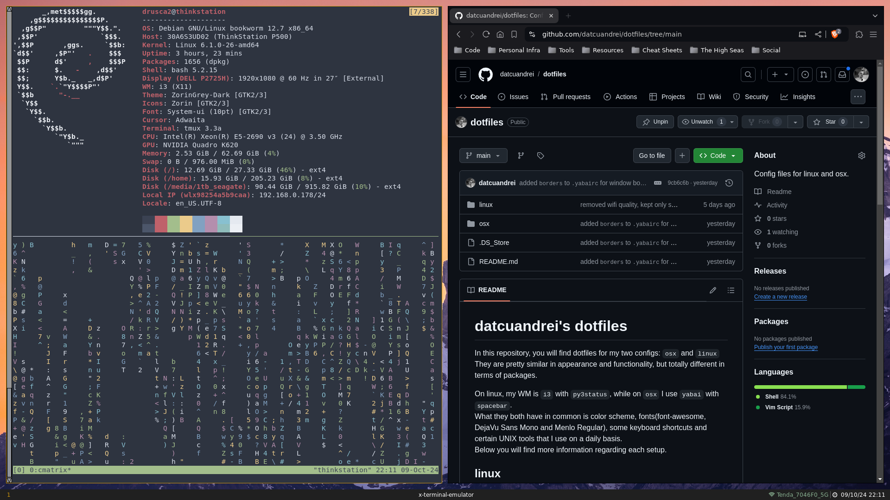
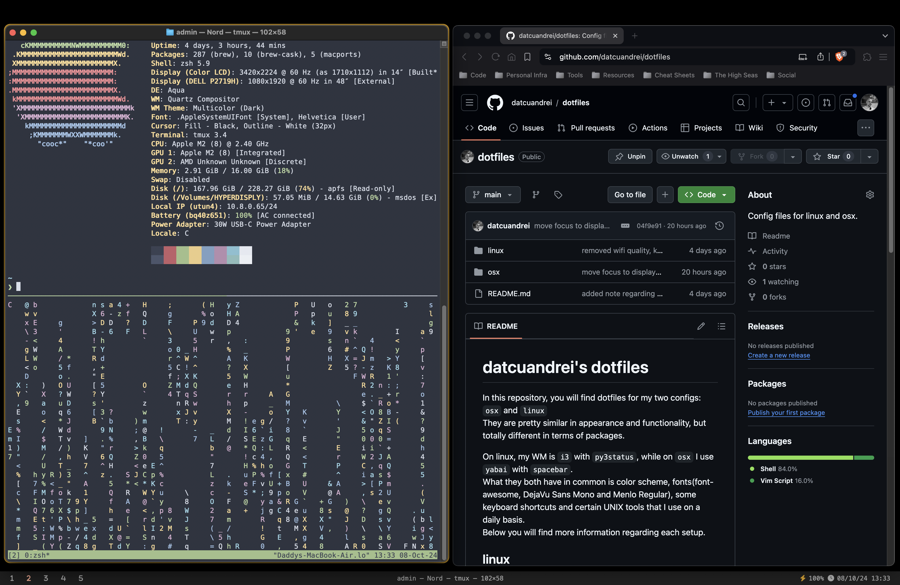

# datcuandrei's dotfiles

In this repository, you will find dotfiles for my two configs: `osx` and `linux`
<br>They are pretty similar in appearance and functionality, but totally different in terms of packages.

On linux, my WM is `i3` with `py3status`, while on `osx` I use `yabai` with `spacebar`.
<br>What they both have in common is color scheme, fonts(font-awesome, DejaVu Sans Mono and Menlo Regular), some keyboard shortcuts and certain UNIX tools that I use on a daily basis.
<br>Below you will find more information regarding each setup.

linux
---

> Screenshot of config as of 3/Oct/24
```apt
i3
i3lock
py3status
picom
dmenu
vim
xbindkeys
hsetroot
xterm
```

dotfiles location : `~` 
<br>NOTE: for `i3` and `picom.conf`, they belong in `~/.config/`.


osx
---

> Screenshot of config as of 3/Oct/24
```brew
koekeishiya/formulae/yabai
koekeishiya/formulae/skhd
cmacrae/formulae/spacebar
```

to start the configs:
```zsh
skhd --start-service # or brew services start skhd
yabai --start-service # or brew services start yabai
brew start start spacebar
```

dotfiles location : `~` 
<br>NOTE: This setup is SIP-friendly! You can use it with SIP enabled without issues.
<br>NOTE: the rc's `.yabairc` and `.spacebarrc` are executables.
<br>NOTE: `Nord.terminal` is for `Terminal.app`, only difference from the original theme being that it has a different font from the original one.
